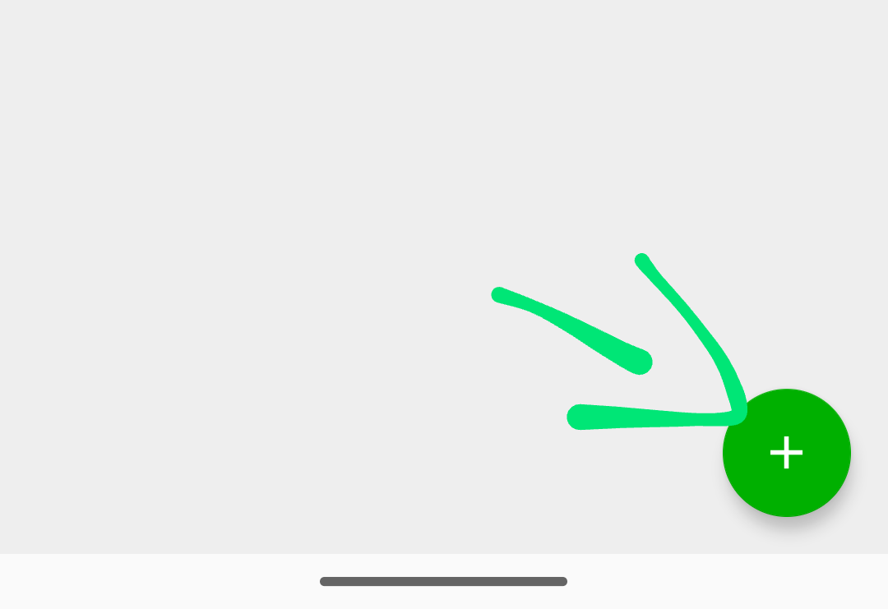
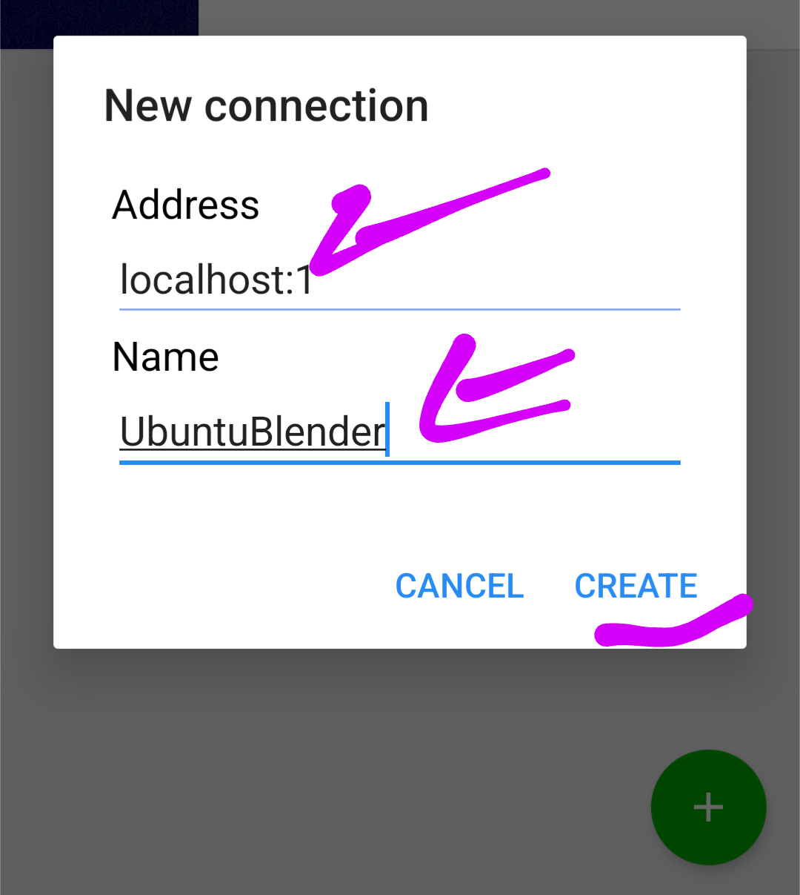

# Instalación de Ubuntu Blender en Termux

Esta guía describe cómo configurar Termux, descargar un archivo necesario, y extraerlo para instalar Ubuntu Blender.

---

## Requisitos previos

- Termux instalado en tu dispositivo Android desde 0. Preferiblemente si eres nuevo en esgo borra la app y vuelve a instalarlo y sigue esta guia después de su instalación.
- Conexión a Internet estable.
- Al menos **4GB de almacenamiento libre**.
- Archivo `ubuntu-blender.tar.gz` descargado desde [este enlace](https://www.mediafire.com/file/vx18m795x44sp8m/ubuntu-blender.tar.gz/file) y ubicado en la carpeta de descargas predeterminada (`Downloads`).

---

## Instrucciones

1. **Actualizar e instalar herramientas esenciales**  
   Ejecuta los siguientes comandos en Termux uno por uno:  

```
yes | pkg update && yes | pkg upgrade
```
```
yes | pkg install termux-am
```
```
termux-setup-storage
```

Estos comandos actualizarán Termux y permitirán el acceso al almacenamiento del dispositivo.

2. Cambiar al directorio de Termux
Cambia al directorio base de Termux con el comando:
```
cd /data/data/com.termux/files/
```

3. Verificar la descarga del archivo
Asegúrate de que el archivo `ubuntu-blender.tar.gz` está en la carpeta de descargas predeterminada `(/sdcard/Downloads/)` de tu dispositivo.
Además, asegúrate de tener al menos 4GB de almacenamiento libre.


4. Extraer el archivo
Ejecuta el siguiente comando para extraer el contenido del archivo:
```
tar -zxf /sdcard/Downloads/ubuntu-blender.tar.gz --recursive-unlink --preserve-permissions
```
Esto descomprimirá el archivo en la ubicación especificada.

luego cierra termux con `exit` para guardar los nuevos cambios y ahora si vuelve abrir termux


---

Notas adicionales

Si encuentras problemas durante la instalación, verifica que tienes permisos suficientes y que el archivo se descargó correctamente.

Puedes usar el siguiente comando para verificar el almacenamiento disponible:
```
df -h
```

Asegúrate de no interrumpir el proceso de extracción para evitar errores.


### Iniciar 

instala VNC Viewer de Play Store
[Instalar VNC](https://play.google.com/store/apps/details?id=com.realvnc.viewer.android)

Crea una máquina nueva en el signo de +




En termux pon `vnc-start` para iniciar despues abre la app vnc viewer y abre tu máquina creada y pon la contraseña `123456` y conectate.
para desconectarte en termux importante `vnc-stop` y luego `exit` dos veces.

---
